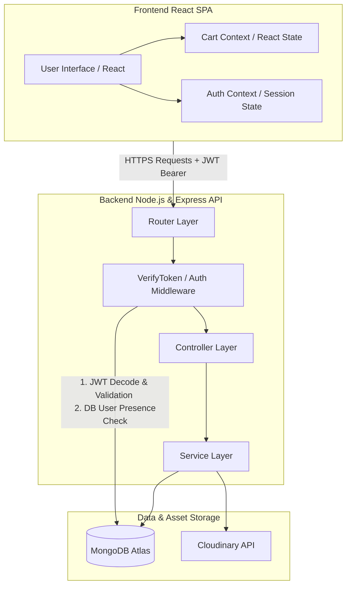

# 🌾 Farm-to-Table E-Commerce Platform

[](https://react.dev/)
[](https://nodejs.org/)
[](https://www.mongodb.com/)
[](https://www.docker.com/)

A premium, enterprise-grade digital marketplace developed for the **Department of Agriculture (DA)**. This initiative bridges the gap between local Filipino agricultural producers and citizens, providing an elegant, transparent, and direct platform for farm-fresh commerce.

---

## 🏗️ System Architecture

The application is structured as a decoupled client-server architecture with state-of-the-art security, asynchronous processing, and robust data persistence.



---

## 🚀 Key Features

### 👤 Customer Experience
*   **Animated Marketplace Landing:** A modern, animated landing page that details the initiative.
*   **Secure Authentication:** State-persistent JWT authentication with protected client-side routes.
*   **Smart Product Catalog:** Real-time search, category filtering (Crops vs. Poultry), and multi-criteria sorting.
*   **Database-Backed Shopping Cart:** Contents are synced dynamically to the database, ensuring zero cart-loss across multiple sessions.
*   **Real-time Stock Protection:** Strict checkout inventory checks to prevent stock over-purchasing.
*   **Order Tracking:** Ability to view past orders and cancel pending ones.

### 🛡️ Admin & Department of Agriculture Operations
*   **Interactive Analytics Dashboard:** Real-time summary statistics, recent transactions stream, and a dynamic 7-day revenue trend chart.
*   **Cascading User Management:** Ability to manage citizen accounts with full cascading deletion (cleaning up active carts and orders automatically).
*   **Inventory & Catalog Control:** Complete CRUD actions for listing crops and poultry, including seamless remote image uploads handled via Cloudinary.
*   **Intelligent Order Fulfillment:** Confirm pending orders to capture transaction revenue and auto-decrease inventory stock.
*   **Sales Performance Reporting:** Weekly, monthly, and annual sales breakdowns with aggregate indicators and CSV export tools.

---

## 📂 Project Structure

```text
├── backend/
│   ├── src/
│   │   ├── config/          # Database & Cloudinary configurations
│   │   ├── controllers/     # API route handlers & request parsing
│   │   ├── middlewares/     # Auth, error handling, & session filters
│   │   ├── models/          # Mongoose schemas & Mongo structures
│   │   ├── routes/          # Express route mappings
│   │   ├── services/        # Core business & database logic
│   │   └── utils/           # Helper functions & CLI tools
│   ├── package.json
│   └── tsconfig.json
├── frontend/
│   ├── src/
│   │   ├── components/      # Premium, reusable UI modules
│   │   ├── context/         # Auth and Cart states (React Context)
│   │   ├── hooks/           # State management hooks
│   │   ├── pages/           # Landing, Consumer Shop, & Admin views
│   │   └── services/        # HTTP API communications
│   ├── package.json
│   └── vite.config.ts
└── docker-compose.yml
```

---

## 🛠️ Getting Started

### Prerequisites

Ensure you have the following installed on your machine:
*   [Node.js](https://nodejs.org/) (v18 or higher)
*   [Docker Desktop](https://www.docker.com/products/docker-desktop/) (for containerized setup)
*   A [MongoDB Atlas](https://www.mongodb.com/cloud/atlas) connection string
*   A [Cloudinary](https://cloudinary.com/) account for image uploads

---

### Configuration

Set up environment variables in both layers before launching the platform:

#### 1. Backend Configuration (`backend/.env`)
Copy the template and fill in your secure credentials:
```bash
cp backend/.env.example backend/.env
```
Ensure the following variables are configured:
*   `MONGODB_URI`
*   `JWT_SECRET`
*   `CLOUDINARY_CLOUD_NAME`
*   `CLOUDINARY_API_KEY`
*   `CLOUDINARY_API_SECRET`

#### 2. Frontend Configuration (`frontend/.env`)
Copy the template:
```bash
cp frontend/.env.example frontend/.env
```

---

### Run Instructions

#### Option A: Running with Docker (Recommended)
Docker automatically coordinates services, volumes, and ports. From the root directory:
```bash
docker compose up --build
```
*   **Frontend Access:** [http://localhost:5173](http://localhost:5173)
*   **Backend Server:** [http://localhost:5000](http://localhost:5000)

#### Option B: Running Natively
Open two separate terminal windows:

##### Terminal 1: Backend Service
```bash
cd backend
npm install
npm run dev
```

##### Terminal 2: Frontend Client
```bash
cd frontend
npm install
npm run dev
```

---

## 📸 Interface Preview

### 📍 Landing Page
Introduces the Dept. of Agriculture marketplace initiative with premium, animated components.


---

### 🔑 Authentication (Sign Up & Log In)
Dual-role routing and state protection ensure seamless sessions.
| Sign Up | Log In |
|:---:|:---:|
|  |  |

---

### 🛒 Consumer Marketplace
Highly interactive product catalog with search, filter, and state-persistent drawers.
| Shop & Products | Shopping Cart Drawer |
|:---:|:---:|
|  |  |

---

### 📦 Customer Profile & Orders
Comprehensive user dashboard for managing credentials and monitoring order statuses.
| Profile Settings | Order History |
|:---:|:---:|
|  |  |

---

### 📊 Admin Operations Center
Complete visual indicators and controls designed for Department of Agriculture staff.
*   **Overview Dashboard:**
    
*   **User Management:**
    
*   **Inventory Panel:**
    
*   **Order Fulfillment:**
    
*   **Sales Reports:**
    
